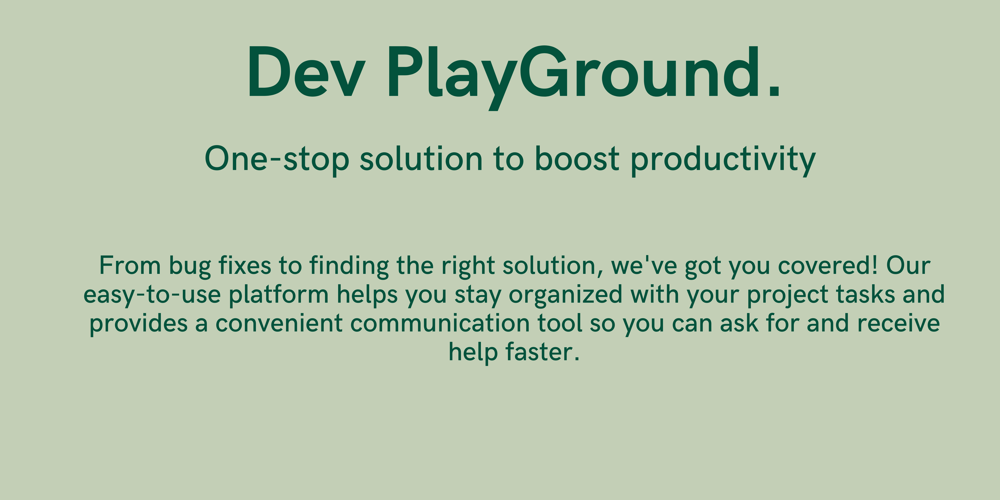
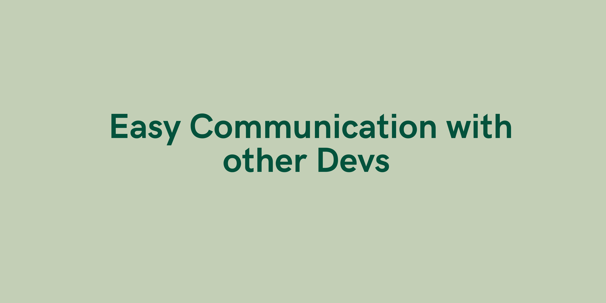
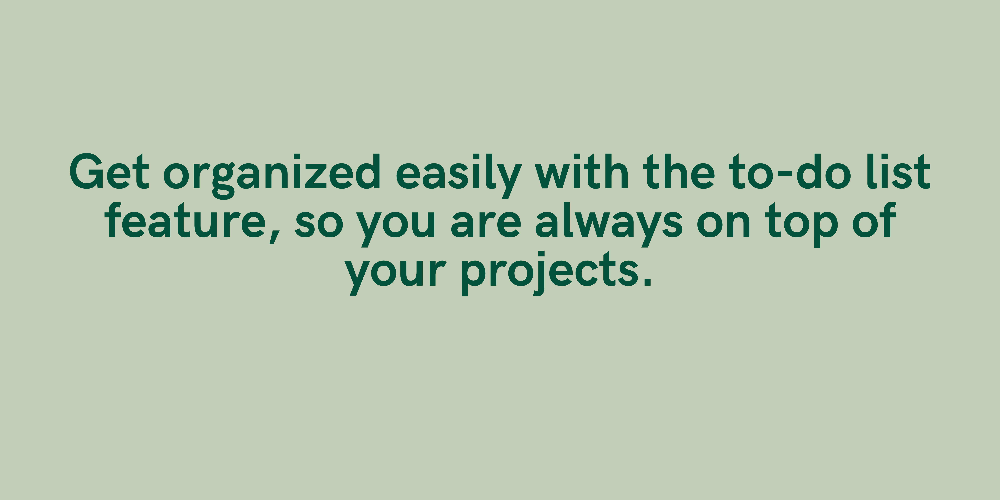

Take your projects to the next level with Dev Play Ground! Our easy-to-use platform makes communication simple for developers to share and collaborate faster. Plus, our project to-do list feature helps you keep focused on what matter most. With Dev Play Ground all of your development needs, bugs and errors will be straightforward while you progress on your projects faster. Join thousands of developers who are now using Dev Play Ground and get the most out of developing!

In this section you can post your problems, bugs and errors to know the solution from the other folks in the community. You can also post your screenshots of your projects and get suggestions for the enhancing it and build it with the communities help. Lets Get Started!

In this section you can manage your project todo list for managing your project. Get organized easily with the to-do list feature, so you are always on top of your projects.